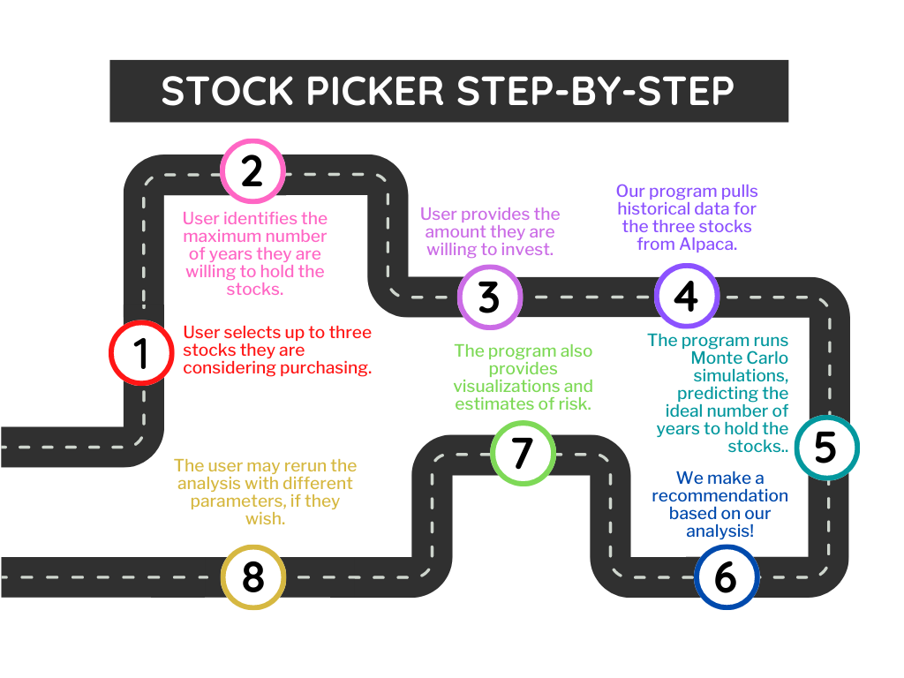

### Purpose
___
## THE STOCK PICKER 
>**Aims to optimize ROI based on holding period.**

___

### Goal
> __THE STOCK PICKER__ engages the unknown factors in trading via simulations tracking. Tracking stocks in simulated environment allows our metrics to close the gaps in hypertrading markets.

### User

### Potential Benefits
1) User can benefit from Volatility Analysis in picking the right stocks w/ lower acceptable risks relative to its returns.
2) Holding period lays out a strategy that incorporates posibilities in pursuit of opportunities as well as recognizing trade-offs.
3) Tax consequencies are better managed by our Capital Gains Deferment module.

### Application Dependencies
    -os
    -requests
    -questionary
    -json
    -pandas
    -dotenv
    -alpaca_trade_api
    -random
    -MCForecastTools
    -%matplotlib inline
    -hvplot
    -pip

### Language:
> Python 3.7

### Framework
> `Alpaca API` \
> `Monte Carlo Simulation` 

### Operating system
> `Windows` \
> `Linux` \
> `Mac`
___

### Installation Guide

To repeat the analysis on your own machine, simply open the Jupyter notebok in a web browser and run each cell. This will provide data analysis as well as visualization through a variety of graphs.

# Contributors

#### Thanks for your contributions:
> **Rachel Phillips --- Isabella Barrera --- Christian Alimbo**

>`Contact:`

>www.thestockpicker.org

### License

MIT